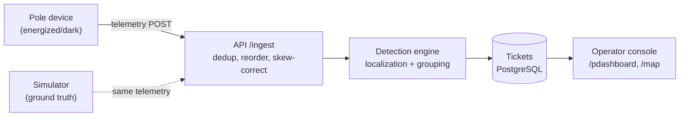

# Architecture

## Data flow

## Data sourcing and ingestion

Devices POST to `/ingest` with `{device_id, pole_id, event, energized, ts, seq, battery_mv, rssi, fw}`.

- **Deduplication**: per-device sequence counter; replayed or late packets (seq already seen or lower) are dropped.
- **Ordering**: per-device sequence is the only reliable order; `ts` is ignored for sequencing (skew up to ±90 s).
- **Bursts**: a 5,000-message burst in 10 s must not drop data; buffer and process in the ingest handler.
- **Firmware 1.2** (~8% of fleet): no `power_lost` event — device simply stops heartbeating. Detected by absence of any event for >1 heartbeat window.
- The simulator produces telemetry indistinguishably from real devices through the same `/ingest` endpoint.

## Storage and internal model

Two schemas, never joined:

| Schema | Who sees it | Contents |
|--------|-------------|----------|
| `gt_topology` | Simulator only | Complete parent-child edges, seq_on_line, children[] per pole |
| `poles`, `transformers`, `feeders`, `substations` | API and operator | Registry data; 60% of DTs missing `seq_on_line` and `parent_pole_id` |

The hierarchy is a rooted tree: Substation → Feeder → Distribution Transformer → Poles.

The **registry** is the API's source of truth for topology. Where `parent_pole_id` is NULL, the tree is unknown — the system cannot walk the pole chain.

## Simulator

The simulator models the pole-device fleet as independent actors, not a list of fake events.

**Virtual clock.** The simulator owns time. `sim_time` advances at `multiplier ×` wall time (default 30×, runtime-adjustable via `POST /clock`). **Changing the multiplier rebases the clock anchor** so sim time never jumps discontinuously — the current sim instant becomes the new `bootSimTime` and `now` becomes the new `bootWallTime`. Every timestamp in the system — telemetry `ts`, fault start, scheduled-outage windows — lives in this sim-time base. The API is a clock client: it reads `GET /sim/clock` (proxied as `GET /clock`) rather than keeping its own, so a multiplier change in the UI cannot cause the two services to drift.

**Per-device telemetry model.** Each device has a fixed profile:

- **Firmware**: ~8% of the fleet runs 1.2.x, which never sends `power_lost` — it just goes silent.
- **Clock skew**: fixed per-device offset in `[−90, +90] s`, baked into `ts`. Two devices that go dark in the same sim instant can report minutes apart.
- **Radio quality**: RSSI-derived transmission delay (`max(0, |rssi|−75)·2 s`). A downstream device with good radio can reach the API before the fault pole does.
- **Delivery**: `power_lost` succeeds ~70% of the time for fw ≥ 1.3 (capacitor reserve), 0% for fw 1.2.x.
- **Heartbeats**: every 900 s ± 45 s, scheduled per device so steady-state traffic is spread across the window rather than bunched.
- **Warm-up**: at simulator boot, each device sends its first heartbeat (seq=1) at a random instant within a 120 s window, establishing the energized baseline without a startup burst or fabricated `boot`/`power_restored` events.

**Unified delivery queue.** All events — heartbeats, fault telemetry, restoration, noise — flow through a single min-heap keyed by **sim-time delivery instant** (`deliverAtSim`). A dispatcher polls the clock (~50 ms wall) and feeds a worker pool (8 workers) that calls the fan-out emitter (API ingest + SSE broadcast). This means:

- Emission happens off the engine lock — a slow API cannot stall heartbeat scheduling or fault injection.
- Radio delay offsets `deliverAtSim`, producing true out-of-order arrivals (a downstream device with good radio can be delivered before the fault pole).
- Pausing the clock freezes delivery entirely; events scheduled during pause are delivered on resume.
- Device clock skew is applied in the wall domain (`ts = WallForSim(eventSim) + skewSecs`), so the ±90 s spread is independent of the multiplier.

**Fault injection.** Supports three types via `POST /sim/faults`: span (`{type:"span", parent_id, child_id}`), DT (`{type:"dt", target_id}`), feeder (`{type:"feeder", target_id}`). Each validates against ground-truth topology, returns a unique sequential fault ID, and queues `power_lost` for affected devices with the correct delivery times.

**Noise injection.** `POST /sim/noise` supports:
- `device_death`: stops heartbeats while power stays on (tests dead-sensor detection)
- `duplicate`: re-emits a recent event with the same seq (at-least-once)
- `stale_replay`: emits an old `power_lost` with a stale timestamp/seq (6-hour retry)

**Scheduled outages.** `GET /scheduled-outages?from=...&to=...` returns a deterministic mock feed (feeder/DT scopes, 20–40 min overruns, ~10% listed-but-cancelled). The future API will use this to suppress tickets.

**Restoration.** On repair, each device sends `boot` then `power_restored` staggered by 0–20 sim seconds (per spec "typically within 20 seconds"), both through the delivery queue with radio delay. Overlapping faults are handled correctly: a pole re-energizes only if no other active fault still covers it.

## Localization algorithm

The detection system uses a two-phase approach: **temporal buffering** followed by **topology-aware localization**.

### Phase 1: Temporal buffering

When a `power_lost` event arrives, the ingestor starts a 60-second wall-clock timer for that DT. During this window:

- All `power_lost` events for the DT are collected (poles that went dark)
- All `heartbeat` events for the DT are collected (poles that stayed lit)
- If ALL dark poles restore before the timer fires, the detection is cancelled (transient fault)

This buffer handles clock skew (±90s) and radio delay (0-48s) by waiting long enough for all events to arrive.

### Phase 2: Localization

Two paths based on topology availability:

**Path A: Known topology (40% of DTs)**

1. Sort dark and lit poles by `seq_on_line` (position from transformer)
2. Walk the sequence to find contiguous dark groups
3. Each dark group = one fault. The fault boundary is between the last lit pole upstream and the first dark pole
4. Multiple dark groups with lit poles between them = multiple simultaneous faults
5. Target ID format: `P-upstream→P-first_dark` (e.g., `P-004→P-005`)

**Path B: Unknown topology (60% of DTs)**

1. Cannot determine pole ordering, so report at DT level
2. If all device-equipped poles are dark → full DT outage
3. If some are dark → partial DT outage with list of affected poles
4. Lower confidence score reflects the coarser localization

**Confidence scoring:**

- Base: 0.7 (known topology) or 0.5 (unknown topology)
- +0.15-0.25 if all downstream poles dark and no unexpected poles affected
- +0.1 proportional to fraction of devices reporting
- Range: 0.1 to 0.99
- After 15 minutes, active tickets get +0.15 refinement (more data = higher confidence)

**Complexity:** O(n log n) per DT where n = number of poles (max ~240, typically ~70).

**Known failure cases:**
- Two faults very close in sequence (< 30s time gap between first dark events) may be merged into one
- If a downstream pole with good radio reports before the fault pole, the initial estimate may be wrong (refined after 15 min)
- fw 1.2 devices that go silent (no `power_lost`) take 15-30 min to detect via missed heartbeats

## Noise handling

The simulator provides explicit noise injection for testing the detection pipeline:

| Kind | Effect |
|------|--------|
| `device_death` | Selected device(s) stop heartbeating while power stays on; no `power_lost` is sent. Tests the "dead sensor vs real outage" logic. |
| `duplicate` | Re-emits a recent event (same seq) from a device. Tests at-least-once deduplication. |
| `stale_replay` | Emits a `power_lost` with a timestamp ~2 hours in the past (sim) and original seq. Tests the 6-hour retry behavior. |

Scheduled outages are published via the mock feed; the simulator honors them by darkening the scope's devices with normal `power_lost` telemetry and restoring after the window. The future API uses the feed to avoid false tickets during outage windows.

## API surface

Implemented endpoints (API server on port 8080):

| Method | Path | Purpose |
|--------|------|---------|
| POST | `/ingest` | Telemetry from devices and simulator — processed by ingestor with dedup and temporal buffering |
| GET | `/tickets` | List all detection tickets |
| GET | `/tickets/stream` | SSE stream of ticket updates (created, refined, verified) |
| GET | `/stats` | Ingest stats and topology counts |
| GET | `/healthz` | Health check (pings PostgreSQL) |

Simulator endpoints (port 8081, proxied via Vite):

| Method | Path | Purpose |
|--------|------|---------|
| GET | `/clock` | Current sim time and multiplier |
| POST | `/clock` | Set multiplier, step time, or pause/resume |
| GET | `/sim/topology/tree` | Ground-truth hierarchy |
| GET | `/sim/faults` | List active faults |
| POST | `/sim/faults` | Inject fault (span/dt/feeder) |
| POST | `/sim/faults/{id}` | Repair one fault |
| POST | `/sim/faults/repair` | Repair all active faults |
| POST | `/sim/noise` | Inject noise (device_death/duplicate/stale_replay) |
| GET | `/scheduled-outages` | Mock planned-outage feed |
| GET | `/sim/events/stream` | SSE stream of all telemetry events |

## UI reasoning

**Operator sees first**: the active-ticket table sorted by age and severity. At 2 a.m. the question is "what broke, where, how bad, what next" — a dense list with a detail panel on click.

**What was left out**: a table of healthy assets (absence of alarm is the healthy state), crew dispatch/routing, raw telemetry firehose, authentication UI.

**Decision expected to be wrong**: map and list as separate pages may not satisfy the rubric's "map and list working together"; the fallback is a split-pane dashboard.

## Frontend architecture

### Fault Injector

The fault injector shows the full ground-truth network as an interactive node-link diagram on an HTML canvas.

**Tree layout**: `d3.tree()` with `nodeSize([DY, DX])` — horizontal tidy tree. `node.y = depth` → canvas x (left-to-right); `node.x = sibling-order` → canvas y (top-to-bottom). The virtual root (`__root__`) and its edge to the substation are filtered from rendering.

**Collapse/expand**: `d3.tree()` only positions nodes reachable via `node.children`. On collapse, children are stashed in `node._children` and `node.children` is set to undefined — the layout reflows, siblings reclaim the space. On expand, `_children` is restored. This is the standard `_children` stash pattern.

**Rendering**: HTML Canvas (not SVG). Canvas is `devicePixelRatio`-aware. Rendering is fully imperative — a `doRender()` function reads from refs for always-fresh data. `FaultInjectorProvider` (React context) owns state; the canvas does not.

**State persistence**:
- `collapsedIds` and `transform` (zoom/pan): sessionStorage, restored on mount — operator's view is stable across tab switches
- `selection`: component-local, resets on tab switch — not persisted

**Context shape** (`FaultInjectorContext`): `{ nodes, links, networkData, collapsedIds, selection, transform, toggleCollapse, expandAll, collapseAll, select, updateTransform }`. The context is designed so future server event handlers can call `updateNodes()` or `updateNode()` without restructuring the tree layout or canvas component.

**Node rendering**:
- Substation/Feeder/DT: labeled rectangles with type badge and downstream count badge
- Pole (has device): filled circle (white when energized, dark red when de-energized)
- Pole (no device): hollow dashed circle
- No distinct marker for branch points — multiple outgoing edges convey the branching visually

**Edge rendering**:
- Solid line: edge is known in registry (child has `parent_pole_id`)
- Dashed line: edge is unknown in registry (the ~60% DT topology gap — visually obvious on DTs with `has_topology: false`)
- Active fault: highlighted red with an ✕ marker at the midpoint of the faulted span

**Interactions**:
- Mouse wheel: zoom (centered on cursor)
- Click-drag on empty canvas: pan
- Click on node: select
- Click on edge: select (14px hit detection threshold)
- Click on expand/collapse indicator: toggle subtree visibility
- Click on empty canvas: deselect
- Ctrl+click: multi-select

**Pulse animations**: Telemetry events from the SSE stream spawn expanding rings on the affected pole (color-coded: red `power_lost`, green `power_restored`, amber `boot`, blue `heartbeat`). Events are batched at ~10 Hz to avoid per-event React re-renders during bursts. The canvas redraw loop runs on `requestAnimationFrame` while pulses are active.

**Auto-expand on inject**: When a fault is injected, all collapsed ancestors of the affected poles (up through DT → feeder → substation) are automatically expanded so the operator immediately sees the pulse animation.

### AI feature

*Not yet determined.* One paragraph to be added when the feature is chosen. Required: what it does, why that spot specifically, cost per call, and what happens when the model is unavailable.