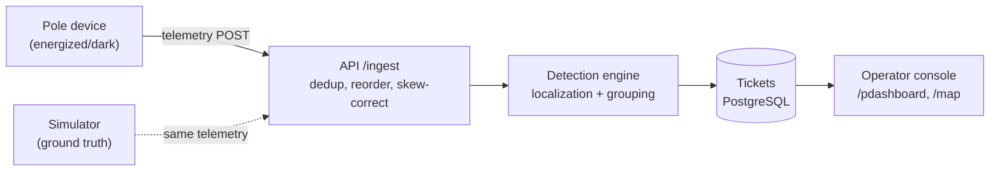

# Architecture

## Data flow

## Data sourcing and ingestion

Devices POST to `/ingest` with `{device_id, pole_id, event, energized, ts, seq, battery_mv, rssi, fw}`.

- **Deduplication**: per-device sequence counter; replayed or late packets (seq already seen or lower) are dropped.
- **Ordering**: per-device sequence is the only reliable order; `ts` is ignored for sequencing (skew up to ±90 s).
- **Bursts**: a 5,000-message burst in 10 s must not drop data; buffer and process in the ingest handler.
- **Firmware 1.2** (~8% of fleet): no `power_lost` event — device simply stops heartbeating. Detected by absence of any event for >1 heartbeat window.
- The simulator produces telemetry indistinguishably from real devices through the same `/ingest` endpoint.

## Storage and internal model

Two schemas, never joined:

| Schema | Who sees it | Contents |
|--------|-------------|----------|
| `gt_topology` | Simulator only | Complete parent-child edges, seq_on_line, children[] per pole |
| `poles`, `transformers`, `feeders`, `substations` | API and operator | Registry data; 60% of DTs missing `seq_on_line` and `parent_pole_id` |

The hierarchy is a rooted tree: Substation → Feeder → Distribution Transformer → Poles.

The **registry** is the API's source of truth for topology. Where `parent_pole_id` is NULL, the tree is unknown — the system cannot walk the pole chain.

## Localization algorithm

*Not yet implemented*

## Noise handling

*Not yet implemented*

## API surface

*Not yet implemented. Planned endpoints:*

| Method | Path | Purpose |
|--------|------|---------|
| POST | `/ingest` | Telemetry from devices and simulator |
| GET | `/tickets` | List tickets, filterable by status, age |
| GET | `/tickets/:id` | Ticket detail with evidence |
| PATCH | `/tickets/:id` | Advance lifecycle (acknowledge, assign crew, resolve) — resolve rejected if telemetry still dark |
| GET | `/tickets/:id/evidence` | Last N telemetry events that contributed to detection |
| GET | `/clock` | Current sim time and multiplier |
| POST | `/clock` | Set multiplier or step time |
| GET | `/poles` | Registry poles with last known state |
| GET | `/network/tree` | Registry-known hierarchy (not ground truth) |
| GET | `/sim/topology/tree` | Ground-truth hierarchy — served by simulator, not API |
| POST | `/sim/faults` | Inject fault — simulator endpoint |
| POST | `/sim/faults/:id/repair` | Repair fault — simulator endpoint |
| POST | `/sim/noise` | Inject noise — simulator endpoint |
| GET | `/scheduled-outages` | Mock feed — simulator endpoint |

## UI reasoning

**Operator sees first**: the active-ticket table sorted by age and severity. At 2 a.m. the question is "what broke, where, how bad, what next" — a dense list with a detail panel on click.

**What was left out**: a table of healthy assets (absence of alarm is the healthy state), crew dispatch/routing, raw telemetry firehose, authentication UI.

**Decision expected to be wrong**: map and list as separate pages may not satisfy the rubric's "map and list working together"; the fallback is a split-pane dashboard.

## AI feature

*Not yet determined.* One paragraph to be added when the feature is chosen. Required: what it does, why that spot specifically, cost per call, and what happens when the model is unavailable.
