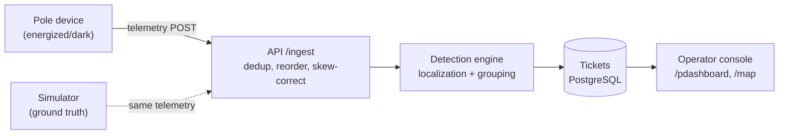

# Architecture

## Data flow

## Data sourcing and ingestion

Devices POST to `/ingest` with `{device_id, pole_id, event, energized, ts, seq, battery_mv, rssi, fw}`.

- **Deduplication**: per-device sequence counter; replayed or late packets (seq already seen or lower) are dropped.
- **Ordering**: per-device sequence is the only reliable order; `ts` is ignored for sequencing (skew up to ±90 s).
- **Bursts**: a 5,000-message burst in 10 s must not drop data; buffer and process in the ingest handler.
- **Firmware 1.2** (~8% of fleet): no `power_lost` event — device simply stops heartbeating. Detected by absence of any event for >1 heartbeat window.
- The simulator produces telemetry indistinguishably from real devices through the same `/ingest` endpoint.

## Storage and internal model

Two schemas, never joined:

| Schema | Who sees it | Contents |
|--------|-------------|----------|
| `gt_topology` | Simulator only | Complete parent-child edges, seq_on_line, children[] per pole |
| `poles`, `transformers`, `feeders`, `substations` | API and operator | Registry data; 60% of DTs missing `seq_on_line` and `parent_pole_id` |

The hierarchy is a rooted tree: Substation → Feeder → Distribution Transformer → Poles.

The **registry** is the API's source of truth for topology. Where `parent_pole_id` is NULL, the tree is unknown — the system cannot walk the pole chain.

## Simulator

The simulator models the pole-device fleet as independent actors, not a list of fake events.

**Virtual clock.** The simulator owns time. `sim_time` advances at `multiplier ×` wall time (default 30×, runtime-adjustable via `POST /clock`). Every timestamp in the system — telemetry `ts`, fault start, scheduled-outage windows — lives in this sim-time base. The API is a clock client: it reads `GET /sim/clock` (proxied as `GET /clock`) rather than keeping its own, so a multiplier change in the UI cannot cause the two services to drift.

**Per-device telemetry model.** Each device has a fixed profile:

- **Firmware**: ~8% of the fleet runs 1.2.x, which never sends `power_lost` — it just goes silent.
- **Clock skew**: fixed per-device offset in `[−90, +90] s`, baked into `ts`. Two devices that go dark in the same sim instant can report minutes apart.
- **Radio quality**: RSSI-derived transmission delay (`max(0, |rssi|−75)·2 s`). A downstream device with good radio can reach the API before the fault pole does.
- **Delivery**: `power_lost` succeeds ~70% of the time for fw ≥ 1.3 (capacitor reserve), 0% for fw 1.2.x.
- **Heartbeats**: every 900 s ± 45 s, scheduled per device so steady-state traffic is spread across the window rather than bunched.

Events are emitted through a min-heap keyed by each device's scheduled wall-clock time, so the simulator delivers out-of-order arrival the same way the real network would.

## Localization algorithm

*Not yet implemented*

## Noise handling

*Not yet implemented*

## API surface

*Not yet implemented. Planned endpoints:*

| Method | Path | Purpose |
|--------|------|---------|
| POST | `/ingest` | Telemetry from devices and simulator |
| GET | `/tickets` | List tickets, filterable by status, age |
| GET | `/tickets/:id` | Ticket detail with evidence |
| PATCH | `/tickets/:id` | Advance lifecycle (acknowledge, assign crew, resolve) — resolve rejected if telemetry still dark |
| GET | `/tickets/:id/evidence` | Last N telemetry events that contributed to detection |
| GET | `/clock` | Current sim time and multiplier |
| POST | `/clock` | Set multiplier or step time |
| GET | `/poles` | Registry poles with last known state |
| GET | `/network/tree` | Registry-known hierarchy (not ground truth) |
| GET | `/sim/topology/tree` | Ground-truth hierarchy — served by simulator, not API |
| POST | `/sim/faults` | Inject fault — simulator endpoint |
| POST | `/sim/faults/:id` | Repair one fault — simulator endpoint |
| POST | `/sim/faults/repair` | Repair all active faults — simulator endpoint |
| POST | `/sim/noise` | Inject noise — simulator endpoint |
| GET | `/scheduled-outages` | Mock feed — simulator endpoint |

## UI reasoning

**Operator sees first**: the active-ticket table sorted by age and severity. At 2 a.m. the question is "what broke, where, how bad, what next" — a dense list with a detail panel on click.

**What was left out**: a table of healthy assets (absence of alarm is the healthy state), crew dispatch/routing, raw telemetry firehose, authentication UI.

**Decision expected to be wrong**: map and list as separate pages may not satisfy the rubric's "map and list working together"; the fallback is a split-pane dashboard.

## Frontend architecture

### Fault Injector

The fault injector shows the full ground-truth network as an interactive node-link diagram on an HTML canvas.

**Tree layout**: `d3.tree()` with `nodeSize([DY, DX])` — horizontal tidy tree. `node.y = depth` → canvas x (left-to-right); `node.x = sibling-order` → canvas y (top-to-bottom). The virtual root (`__root__`) and its edge to the substation are filtered from rendering.

**Collapse/expand**: `d3.tree()` only positions nodes reachable via `node.children`. On collapse, children are stashed in `node._children` and `node.children` is set to undefined — the layout reflows, siblings reclaim the space. On expand, `_children` is restored. This is the standard `_children` stash pattern.

**Rendering**: HTML Canvas (not SVG). Canvas is `devicePixelRatio`-aware. Rendering is fully imperative — a `doRender()` function reads from refs for always-fresh data. `FaultInjectorProvider` (React context) owns state; the canvas does not.

**State persistence**:
- `collapsedIds` and `transform` (zoom/pan): sessionStorage, restored on mount — operator's view is stable across tab switches
- `selection`: component-local, resets on tab switch — not persisted

**Context shape** (`FaultInjectorContext`): `{ nodes, links, collapsedIds, selection, transform, toggleCollapse, expandAll, collapseAll, select, updateTransform }`. The context is designed so future server event handlers can call `updateNodes()` or `updateNode()` without restructuring the tree layout or canvas component.

**Node rendering**:
- Substation/Feeder/DT: labeled rectangles with type badge and downstream count badge
- Pole (has device): filled circle
- Pole (no device): hollow dashed circle
- No distinct marker for branch points — multiple outgoing edges convey the branching visually

**Edge rendering**:
- Solid line: edge is known in registry (child has `parent_pole_id`)
- Dashed line: edge is unknown in registry (the ~60% DT topology gap — visually obvious on DTs with `has_topology: false`)

**Interactions**:
- Mouse wheel: zoom (centered on cursor)
- Click-drag on empty canvas: pan
- Click on node: select
- Click on edge: select (14px hit detection threshold)
- Click on expand/collapse indicator: toggle subtree visibility
- Click on empty canvas: deselect

## AI feature

*Not yet determined.* One paragraph to be added when the feature is chosen. Required: what it does, why that spot specifically, cost per call, and what happens when the model is unavailable.
